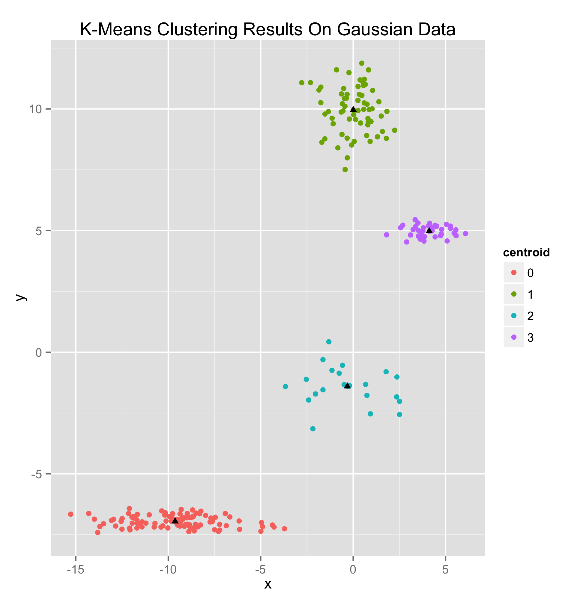

## Clustering Algorithms (Supervised and Unsupervised)
### `import "github.com/admpub/goml/cluster"`

[](https://godoc.org/github.com/admpub/goml/cluster)

This part of the `goml` package implements clustering algorithms, unsupervised _and_ supervised, to give the user options about what model they want to use.

### implemented models

- [k-means clustering](kmeans.go)
    * Uses k-means++ instantiation for more reliable clustering ([this paper](http://ilpubs.stanford.edu:8090/778/1/2006-13.pdf) outlines the method)
	* Both online and batch versions of the algorithm
	* Online version implements the algorithm discussed in [this paper](http://ocw.mit.edu/courses/sloan-school-of-management/15-097-prediction-machine-learning-and-statistics-spring-2012/projects/MIT15_097S12_proj1.pdf)
- [triangle inequality accelerated k-means clusering](triangle_kmeans.go)
    * Implements the algorithm described in [this paper](http://www.aaai.org/Papers/ICML/2003/ICML03-022.pdf) by Charles Elkan of the University of California, San Diego to use upper and lower bounds on distances to clusters across iterations to dramatically reduce the number of (potentially really expensive) distance calculations made by the algorithm.
    * Uses k-means++ instantiation for more reliable clustering ([this paper](http://ilpubs.stanford.edu:8090/778/1/2006-13.pdf) outlines the method)
- [n-nearest-neighbors clustering](knn.go)
	* Can use any distance metric, with L-p Norm, Euclidean Distance, and Manhattan Distance pre-defined within the `goml/base` package

### example k-means model usage

This code produces four clusters (as expected,) which result in the following plot (made with `ggplot2`).



```go
gaussian := [][]float64{}
for i := 0; i < 40; i++ {
	x := rand.NormFloat64() + 4
	y := rand.NormFloat64()*0.25 + 5
	gaussian = append(gaussian, []float64{x, y})
}
for i := 0; i < 66; i++ {
	x := rand.NormFloat64()
	y := rand.NormFloat64() + 10
	gaussian = append(gaussian, []float64{x, y})
}
for i := 0; i < 100; i++ {
	x := rand.NormFloat64()*3 - 10
	y := rand.NormFloat64()*0.25 - 7
	gaussian = append(gaussian, []float64{x, y})
}
for i := 0; i < 23; i++ {
	x := rand.NormFloat64() * 2
	y := rand.NormFloat64() - 1.25
	gaussian = append(gaussian, []float64{x, y})
}

model := NewKMeans(4, 15, gaussian)

if model.Learn() != nil {
	panic("Oh NO!!! There was an error learning!!")
}

// now you can predict like normal!
guess, err := model.Predict([]float64{-3, 6})
if err != nil {
	panic("prediction error")
}

// or if you want to get the clustering
// results from the data
results := model.Guesses()

// you can also concat that with the
// training set and save it to a file
// (if you wanted to plot it or something)
err = model.SaveClusteredData("/tmp/.goml/KMeansResults.csv")
if err != nil {
	panic("file save error")
}

// you can also persist the model to a
// file
err = model.PersistToFile("/tmp/.goml/KMeans.json")
if err != nil {
	panic("file save error")
}

// and also restore from file (at a
// later time if you want)
err = model.RestoreFromFile("/tmp/.goml/KMeans.json")
if err != nil {
	panic("file save error")
}
```
